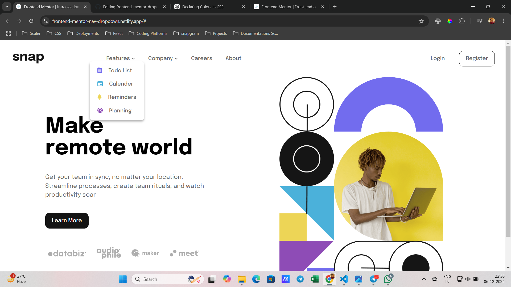
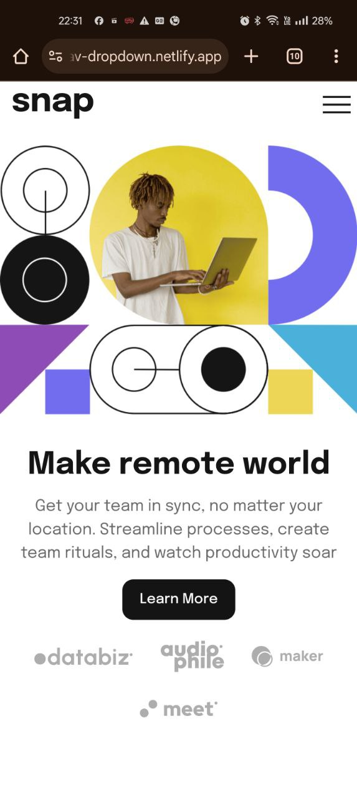
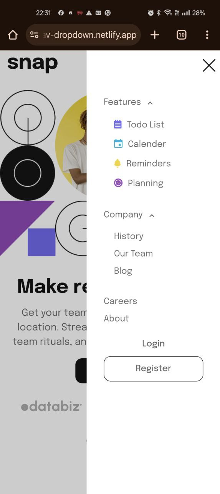

# Responsive Menu and Header Section

### Project Overview

This project involves creating a **responsive menu** and **header section** as part of a challenge from [Frontend Mentor](https://www.frontendmentor.io/).

### Live Preview

You can view the project live here:  
[Frontend Mentor Navigation Dropdown](https://frontend-mentor-nav-dropdown.netlify.app/)

### Features

- Fully responsive navigation menu for mobile and desktop views.
- Smooth dropdown interactions.
- Modern and clean UI.

### Preview

Below are some images showcasing the design and functionality of the project.

